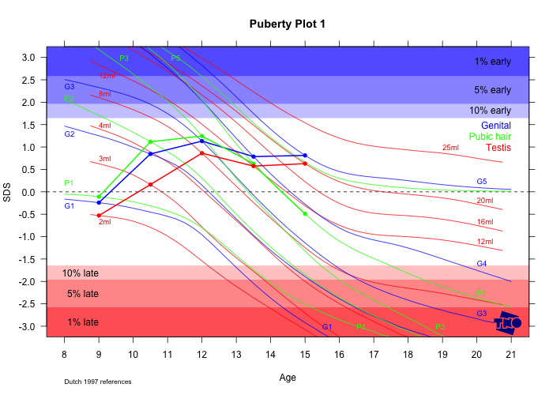

# pubertyplot

Tools to plot Tanner pubertal stage measurements against the Dutch 1997
references and express them as standard deviation scores (SDS).

This package implements the stage line diagram method described in:

> van Buuren, S. and Ooms, J.C.L. (2009). Stage line diagram: An
> age-conditional reference diagram for tracking development. *Statistics
> in Medicine*, 28(11), 1569–1579. <https://doi.org/10.1002/sim.3567>

```bibtex
@article{vanbuuren-2009-1,
  title        = {Stage line diagram: An age-conditional reference diagram for tracking development},
  author       = {{van Buuren}, S. and Ooms, J.C.L.},
  year         = {2009},
  journal      = {Statistics in Medicine},
  volume       = {28},
  number       = {11},
  pages        = {1569--1579},
  doi          = {10.1002/sim.3567}
}
```

This README covers three things:

1. [Calculating SDS in plain R](#1-calculating-sds-in-plain-r) — no web app needed.
2. [Running the local mock web app](#2-running-the-local-mock-web-app) — try the
   browser frontends without setting up Apache/rApache.
3. [Producing bulk diagrams with Puberty Pro](#3-producing-bulk-diagrams-with-puberty-pro) —
   upload a whole dataset and get one PDF with everyone's plot, plus a CSV/TXT
   of SDS values.

For the original production deployment (Apache + rApache), see
[Production deployment (rApache)](#production-deployment-rapache) at the end.

## Installation

```r
# from GitHub
install.packages("devtools")
devtools::install_github("stefvanbuuren/pubertyplot")
```

Or from a local clone:

```r
install.packages("devtools")
devtools::install(".")

# or load without installing, from the repo root
devtools::load_all(".")
```

## Example: plotting a stage line diagram

`plot_stadia()` draws a patient's pubertal stage trajectory against the
Dutch 1997 reference percentiles. Here's a boy followed from age 9 to 15,
tracked on genital stage, pubic hair stage, and testicular volume:

```r
library(pubertyplot)

# tv must be given as the 1-8 stage index here, not raw ml -- see
# "Boys: gen / phb / tv" below for the ml -> stage recoding
mydata <- data.frame(
  id  = 1,
  age = c(9, 10.5, 12, 13.5, 15),
  sex = "M",
  gen = c(1, 2, 3, 4, 5),
  phb = c(1, 2, 3, 4, 4),
  tv  = c(1, 2, 4, 5, 7),
  bre = NA, phg = NA, men = NA
)

plot_stadia(
  data = mydata,
  persons = 1,
  type = c(TRUE, TRUE, TRUE),
  plotline = c(TRUE, TRUE, TRUE),
  title = "Puberty Plot",
  padid = FALSE
)
```



The shaded bands mark the 1%, 5% and 10% earliest/latest percentiles for
each reference curve (Genital in blue, Pubic hair in green, Testis in red);
the thick lines are this patient's own trajectory.

## 1. Calculating SDS in plain R

`calculateSDS(age, stage, type)` converts an age + observed pubertal stage
into a standard deviation score, by interpolating the Dutch 1997 reference
percentiles (`pub.ref`). `type` is one of `"gen"`, `"phb"`, `"tv"`, `"bre"`,
`"phg"` or `"men"`.

```r
library(pubertyplot)

# a single measurement: a 12-year-old boy at genital stage 3
calculateSDS(age = 12, stage = 3, type = "gen")
```

### Girls: bre / phg / men

`bre` and `phg` stages are coded 1–5, `men` is coded 1 (not yet) or 2
(menarche reached) — use them as-is:

```r
girls <- read.csv("inst/webapps/pubertypro/demo.csv")
names(girls) <- tolower(names(girls))
girls$age <- as.numeric(gsub(",", ".", girls$age))
girls <- girls[girls$sex == "F", ]

girls$SDS_bre <- round(calculateSDS(girls$age, girls$bre, "bre"), 2)
girls$SDS_phg <- round(calculateSDS(girls$age, girls$phg, "phg"), 2)
girls$SDS_men <- round(calculateSDS(girls$age, girls$men, "men"), 2)
```

### Boys: gen / phb / tv

`gen` and `phb` are coded 1–5 and can be used as-is. `tv` (testicular volume)
is special: it's normally recorded in **ml** (2, 3, 4, 8, 12, 16, 20 or 25),
but `calculateSDS()` expects the **consecutive stage index 1–8** that those ml
values map to. Recode it first:

```r
boys <- read.csv("inst/webapps/pubertypro/demo.csv")
names(boys) <- tolower(names(boys))
boys$age <- as.numeric(gsub(",", ".", boys$age))
boys <- boys[boys$sex == "M", ]

tv_stage <- boys$tv
tv_stage[!is.na(tv_stage) & tv_stage == 2]  <- 1
tv_stage[!is.na(tv_stage) & tv_stage == 3]  <- 2
tv_stage[!is.na(tv_stage) & tv_stage == 4]  <- 3
tv_stage[!is.na(tv_stage) & tv_stage == 8]  <- 4
tv_stage[!is.na(tv_stage) & tv_stage == 12] <- 5
tv_stage[!is.na(tv_stage) & tv_stage == 16] <- 6
tv_stage[!is.na(tv_stage) & tv_stage == 20] <- 7
tv_stage[!is.na(tv_stage) & tv_stage == 25] <- 8

boys$SDS_gen <- round(calculateSDS(boys$age, boys$gen, "gen"), 2)
boys$SDS_phb <- round(calculateSDS(boys$age, boys$phb, "phb"), 2)
boys$SDS_tv  <- round(calculateSDS(boys$age, tv_stage, "tv"), 2)
```

Keep the original `tv` column (in ml) in your output — only the value passed
to `calculateSDS()` needs recoding, not the data you save or display.

> Note: an age/stage combination can fall outside the plottable range (the
> SDS is effectively ±Inf for an extreme outlier, e.g. genital stage 1 at age
> 19). `calculateSDS()` still returns a value, but [`plot_stadia()`](#3-producing-bulk-diagrams-with-puberty-pro)
> will silently skip drawing a point for it, since it falls off the chart.

### All six SDS at once on a mixed data.frame

`calculateSDS()` is vectorized, so a whole data.frame with both sexes can be
processed in one go. Calling it on a stage column that doesn't apply to a row
(e.g. `gen` for a girl) just returns `NA` for that row, so there's no need to
split the data by sex first:

```r
mydata <- read.csv("inst/webapps/pubertypro/demo.csv")
names(mydata) <- tolower(names(mydata))
mydata$age <- as.numeric(gsub(",", ".", mydata$age))

# tv: ml -> 1-8 stage index, only for the calculateSDS() call
tv_stage <- mydata$tv
tv_stage[!is.na(tv_stage) & tv_stage == 2]  <- 1
tv_stage[!is.na(tv_stage) & tv_stage == 3]  <- 2
tv_stage[!is.na(tv_stage) & tv_stage == 4]  <- 3
tv_stage[!is.na(tv_stage) & tv_stage == 8]  <- 4
tv_stage[!is.na(tv_stage) & tv_stage == 12] <- 5
tv_stage[!is.na(tv_stage) & tv_stage == 16] <- 6
tv_stage[!is.na(tv_stage) & tv_stage == 20] <- 7
tv_stage[!is.na(tv_stage) & tv_stage == 25] <- 8

mydata$SDS_gen <- round(calculateSDS(mydata$age, mydata$gen, "gen"), 2)
mydata$SDS_phb <- round(calculateSDS(mydata$age, mydata$phb, "phb"), 2)
mydata$SDS_tv  <- round(calculateSDS(mydata$age, tv_stage,    "tv"),  2)
mydata$SDS_bre <- round(calculateSDS(mydata$age, mydata$bre, "bre"), 2)
mydata$SDS_phg <- round(calculateSDS(mydata$age, mydata$phg, "phg"), 2)
mydata$SDS_men <- round(calculateSDS(mydata$age, mydata$men, "men"), 2)
```

This is the same calculation [Puberty Pro](#3-producing-bulk-diagrams-with-puberty-pro)
runs for every uploaded dataset.

## 2. Running the local mock web app

[inst/webapps/](inst/webapps/) ships two browser frontends (`puberty` for a
single patient, `pubertypro` for batch upload). They were originally built to
run behind Apache + rApache, which is now hard to set up on modern systems.
[tools/run_mock_webapp.R](tools/run_mock_webapp.R) serves both frontends
locally with [httpuv](https://cran.r-project.org/package=httpuv), without
needing Apache or rApache at all.

### Install

```r
install.packages("httpuv")
install.packages("devtools")   # only needed if you run from a source checkout
```

### Start

From the repo root, in a terminal:

```sh
Rscript tools/run_mock_webapp.R
```

or, from an R/RStudio/Positron console, with the repo as the working directory:

```r
source("tools/run_mock_webapp.R")
```

Either way it prints the URLs and opens the single-patient app in your
default browser automatically:

```
Mock webapps running at:
  http://127.0.0.1:7654/puberty/
  http://127.0.0.1:7654/pubertypro/
Press Ctrl+C to stop.
```

Open `http://127.0.0.1:7654/pubertypro/` yourself for the batch upload app —
only the first URL is opened automatically.

### Stop

- **Terminal (`Rscript`)**: press `Ctrl+C`, or close the terminal.
- **R console (`source()`)**: press `Ctrl+C` in the console (or the
  stop/interrupt button in RStudio/Positron) to break the server loop, or
  restart the R session.

If you try to start a second instance while one is still running, you'll get
`Failed to create server` / `address already in use`. Find and stop the
process holding port 7654:

```sh
# macOS / Linux
lsof -nP -iTCP:7654 -sTCP:LISTEN
kill <PID>
```

```powershell
# Windows (PowerShell)
Get-NetTCPConnection -LocalPort 7654 | Select-Object OwningProcess
Stop-Process -Id <PID>
```

## 3. Producing bulk diagrams with Puberty Pro

The `pubertypro` app processes an entire dataset (many patients) in one go:
it draws one puberty plot per patient into a single multi-page PDF, computes
SDS values for every measurement, and offers the result as a downloadable
CSV/TXT alongside the PDF.

1. [Start the mock server](#2-running-the-local-mock-web-app) and open
   `http://127.0.0.1:7654/pubertypro/`.
2. Upload a data file. Sample files are linked on the page itself, and also
   available directly in the repo:
   [inst/webapps/pubertypro/demo.csv](inst/webapps/pubertypro/demo.csv),
   [demo.sav](inst/webapps/pubertypro/demo.sav),
   [demo.txt](inst/webapps/pubertypro/demo.txt).
   Required columns: `id`, `age`, `sex` (`"M"`/`"F"`), plus `gen`, `phb`, `tv`
   for boys and/or `bre`, `phg`, `men` for girls (NA-able per row).
3. Review the parsed per-patient summary table, then click **GO!**.
4. Download the generated files from the icon links:
   - **PDF** — one page per patient, with the puberty stadia plot
     (`plot_stadia()` under the hood).
   - **CSV** / **TXT** — the original data plus `SDS_gen`, `SDS_phb`,
     `SDS_tv`, `SDS_bre`, `SDS_phg`, `SDS_men` columns.

Doing the same thing from plain R, without the web app, looks like:

```r
library(pubertyplot)

mydata <- read.csv("inst/webapps/pubertypro/demo.csv")
names(mydata) <- tolower(names(mydata))
mydata$age <- as.numeric(gsub(",", ".", mydata$age))

# plot_stadia() expects tv as a 1-8 stage index, not raw ml -- see the
# recoding note in the "Boys: gen / phb / tv" section above
mydata$tv[!is.na(mydata$tv) & mydata$tv == 2]  <- 1
mydata$tv[!is.na(mydata$tv) & mydata$tv == 3]  <- 2
mydata$tv[!is.na(mydata$tv) & mydata$tv == 4]  <- 3
mydata$tv[!is.na(mydata$tv) & mydata$tv == 8]  <- 4
mydata$tv[!is.na(mydata$tv) & mydata$tv == 12] <- 5
mydata$tv[!is.na(mydata$tv) & mydata$tv == 16] <- 6
mydata$tv[!is.na(mydata$tv) & mydata$tv == 20] <- 7
mydata$tv[!is.na(mydata$tv) & mydata$tv == 25] <- 8

pdf("all_patients.pdf", paper = "a4r", width = 11.67, height = 8.27)
plot_stadia(
  data = mydata,
  persons = unique(mydata$id),
  type = c(TRUE, TRUE, TRUE),
  plotline = c(FALSE, FALSE, FALSE),
  padid = TRUE
)
dev.off()
```

## Production deployment (rApache)

The original deployment runs the webapps behind Apache with
[rApache](https://github.com/jeffreyhorner/rApache):

```sh
# install R and the pubertyplot package
R CMD INSTALL pubertyplot_1.4.0.tar.gz

# install rapache, e.g. using the package
sudo apt-get install libapache2-mod-r-base

# copy the site file from the package and activate
sudo cp -Rf /usr/local/lib/R/site-library/pubertyplot/sites-available/puberty /etc/apache2/sites-available
sudo a2ensite puberty

# restart apache
sudo service apache2 restart

# if anything isn't working, check the error log:
tail /var/log/apache2/error.log
```
